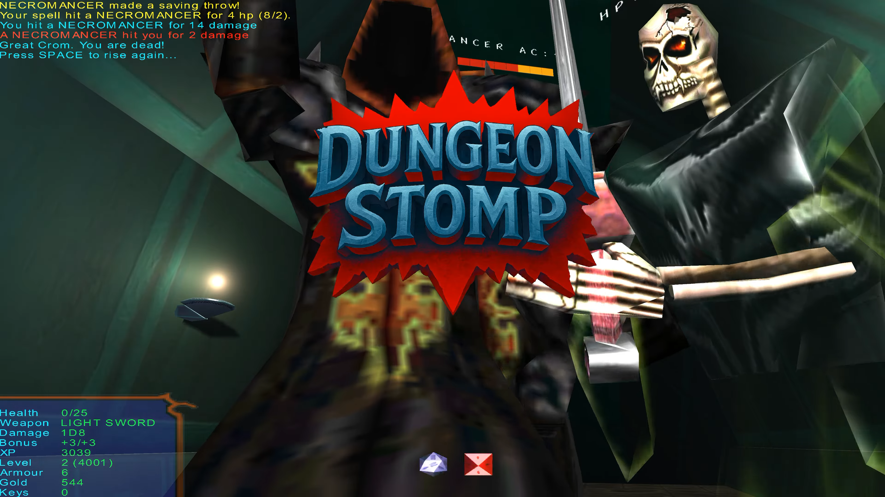
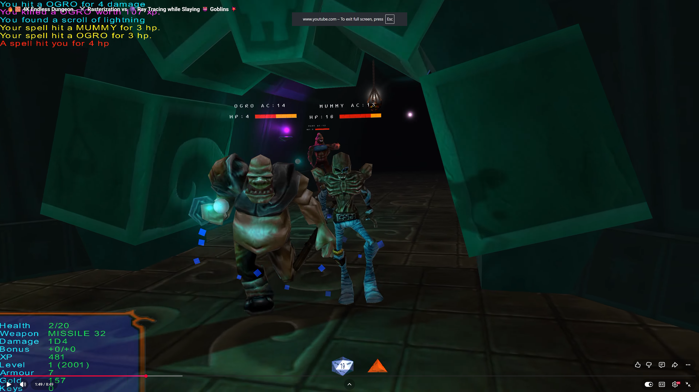
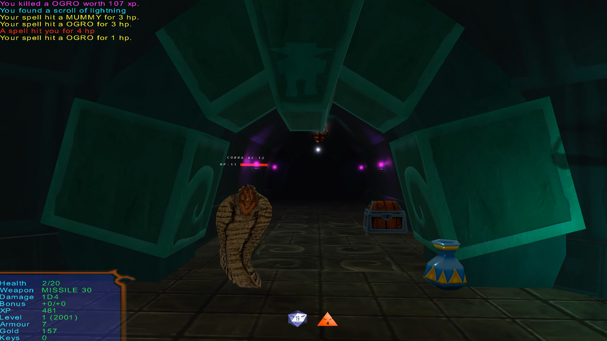

<div align="center">

# Dungeon Stomp DX12 Ultimate DXR

### A Full 3D Dungeon Crawler Engine Showcase for DirectX 12 Ultimate & DXR

[](LICENSE)
[](https://github.com/moonwho101/DungeonStompDX12UltimateDXR)
[](https://devblogs.microsoft.com/directx/announcing-directx-12-ultimate/)
[](https://github.com/moonwho101/DungeonStompDX12UltimateDXR)
[](https://visualstudio.microsoft.com/)



**Most DXR samples stop at a spinning triangle or a Cornell box. Dungeon Stomp is a full, playable dungeon crawler engine that puts DirectX 12 Ultimate's headline features to work in a live production codebase — featuring DXR 1.1 inline ray tracing, PBR, Variable Rate Shading, and SSAO.**

[Play Now](#quick-start) · [Screenshots](#screenshots) · [Features](#features-at-a-glance) · [Build](#build-from-source) · [Controls](#controls)

</div>

---

## ⚡ Quick Start

> **Play immediately** — pre-compiled binary included!

```bash
git clone https://github.com/moonwho101/DungeonStompDX12UltimateDXR.git
cd DungeonStompDX12UltimateDXR/bin
DungeonStomp.exe
```

*Requirements: Windows 10/11 with a DirectX 12 GPU. A DXR-capable GPU (NVIDIA RTX / AMD RX 6000+ / Intel Arc) is recommended for ray tracing features.*

---

## ✨ Features at a Glance

### 🚀 Graphics & Engine (DX12 Ultimate)
- **DXR 1.1 Inline Ray Tracing:** Pixel-perfect ray-traced shadow rays & global illumination.
- **PBR Material Pipeline:** Cook-Torrance BRDF with metallic workflow, 28+ tuned materials, and ACES tone mapping.
- **Variable Rate Shading (VRS):** Hardware-adaptive shading rates for enhanced performance.
- **Dynamic Lighting & Effects:** 2048x2048 shadow maps, SSAO, 32 dynamic lights per scene, normal mapping & atmospheric fog.
- **Engine Tech:** 3-frame buffered rendering, spatial culling, BMFont GPU text rendering, and XAudio2 sound engine.

### ⚔️ Complete Game Campaign
- **15 Dungeon Levels:** Hand-crafted campaign levels + procedural seed-based dungeon generator.
- **25+ Enemy Types:** Animated MD2 & 3DS monsters with AI, audio cues, and loot drops.
- **30+ Weapons & Spells:** Melee, ranged, and magic missile projectile system (up to 100 active missiles).
- **Classic RPG Mechanics:** Level progression, XP system, keys, swinging doors, and persistent save/load state (`F5`/`F6`).

---

## 🖼️ Screenshots

<div align="center">

| Real-Time DXR Ray-Traced Shadows | Dynamic Combat Encounter |
|:---:|:---:|
|  |  |

<details>
<summary><b>📷 Click to view more screenshots</b></summary>

<br>

| | |
|---|---|
|  |  |
|  |  |

</details>

</div>

---

## 🎮 Controls

| Action | Input | Action | Input |
|---|---|---|---|
| **Move** | `W` `A` `S` `D` | **Cycle Weapons** | `Q` / `Z` or `Mouse Wheel` |
| **Attack** | `Left Click` | **Load / Save** | `F5` / `F6` |
| **Forward** | `Right Click` | **Fullscreen** | `Alt`+`Enter` / `F11` |
| **Open Doors** | `Space` | **Debug HUD** | `F8` |
| **Jump** | `E` | **Xbox Controller** | Supported (enabled in `DirectInput.cpp`) |

<details>
<summary><b>🔧 Developer & Feature Hotkeys (Click to expand)</b></summary>

<br>

| Key | Graphics Toggle | Key | Developer / Gameplay Controls |
|:---:|---|:---:|---|
| `R` | Toggle DXR Ray Tracing | `G` | Toggle Noclip / Fly Mode (Numpad `+`/`-`) |
| `T` | Toggle Variable Rate Shading | `X` | Add Experience Points |
| `O` | Toggle SSAO | `K` | Unlock All Weapons & Spells |
| `J` | Toggle Shadow Map | `]` / `[` | Jump to Next / Previous Level |
| `N` | Toggle Normal Maps | `I` / `P` | Disable / Randomize Music |
| `M` | View Shadow Map / SSAO Buffer | `B` | Toggle Camera Head Bob |
| `V` | Toggle VSync | `H` | Toggle Player HUD |

</details>

---

## 🛠️ Build from Source

**Prerequisites:** Visual Studio 2022 (with Desktop development with C++) & Windows 10/11 SDK.

```powershell
git clone https://github.com/moonwho101/DungeonStompDX12UltimateDXR.git
cd DungeonStompDX12UltimateDXR
msbuild src\DungeonStomp.sln /p:Configuration=Release /p:Platform=x64
```

Or open `src/DungeonStomp.sln` in Visual Studio 2022 and build in **Release | x64**. Binary outputs to `bin/DungeonStomp.exe`.

---

<details>
<summary><b>📂 Repository Structure & Dungeon Generator</b></summary>

<br>

### Key Directories
- `bin/` — Pre-built executable, levels, sounds, and assets
- `src/` — Engine & game logic source code (40+ C++ files)
- `Shaders/` — HLSL shader code ([Shaders/Raytracing.hlsl](Shaders/Raytracing.hlsl), PBR, VRS, SSAO)
- `Common/` — D3D12 helper framework (`d3dApp`, `GameTimer`, `MathHelper`)
- `tools/` — Procedural dungeon generation scripts

### Procedural Dungeon Generation
Generate reproducible layout files replacing `bin/level1.map`:
```bash
cd tools
python generate_dungeon.py          # Classic tileset
python generate_dungeonNewObjects.py # Extended tileset
```

</details>

---

## 🌐 Related Projects & Credits

| Project | API |
|---|---|
| [Dungeon Stomp DX12](https://github.com/moonwho101/DungeonStompDirectX12) | DirectX 12 (Rasterization) |
| [Dungeon Stomp Vulkan](https://github.com/moonwho101/DungeonStompVulkan) | Vulkan (WIP) |
| [Dungeon Stomp Classic](https://github.com/moonwho101/DungeonStomp) | DirectX 7 |

*Engine architecture builds upon concepts from "Introduction to 3D Game Programming with DirectX 12" by Frank Luna.*

<details>
<summary><b>🎨 MD2 Model Author Credits</b></summary>

<br>

Special thanks to the authors of the classic MD2 models featured in Dungeon Stomp:

- **ALPHA Werewolf** — Andrew "ALPHAwolf" Gilmour
- **Bauul, Hueteotl, Winter's Faerie** — Evil Bastard
- **Centaur** — Scarecrow
- **Bug (Q2)** — Tatey
- **Corpse** — Neuralstasis
- **Demoness (Succubus)** — Pascal "Firebrandt" Jurock
- **Dragon Knight, Ogro** — Michael "Magarnigal" Mellor
- **Fulimo** — Tim
- **Goblin** — Conrad
- **Grey** — RichB
- **Hellspawn** — Alcor
- **Hydralisk** — warlord
- **Ichabod** — Adam Ward (Gixter)
- **Imp** — Paul Interrante & Brad Grace
- **Insect** — Joe "Ebola" Woodrell
- **Morbo/Brawn** — Rowan Crawford (Sumaleth)
- **Necromancer** — Raven Software
- **Necromicus** — Jade Moffatt Jones
- **Ogre** — Didier "The Doctor" Savanah
- **Orc** — Boogieman
- **Perelith Knight** — James Green
- **Phantom, Wraith** — Burnt Kona
- **Purgatori** — Tom Colby
- **Rider** — Blake
- **Sorcerer** — E. Villiers
- **Tentacle** — Marcus Lutz
- **Troll** — Thargar
- **Werewolf** — Brian Yee

</details>

---

## License

This project is open source. See the [LICENSE](LICENSE) file for details.

---

<div align="center">

**Happy Dungeon Stomping — Breeyark! ⚔️**

*If you find this project useful for learning DirectX 12 or DXR, please drop a ⭐ star above!*

[](https://github.com/moonwho101/DungeonStompDX12UltimateDXR/stargazers)

</div>

