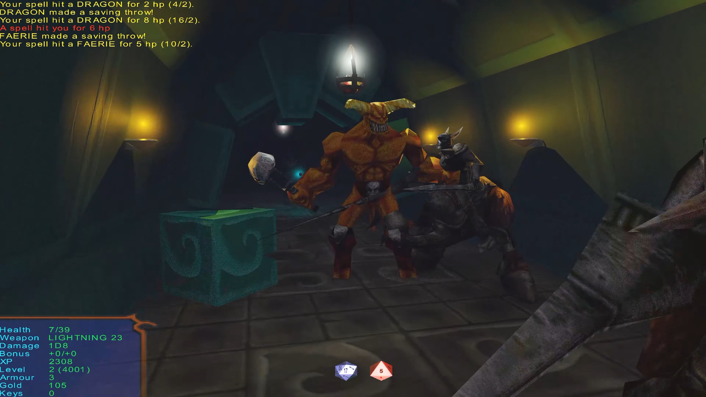
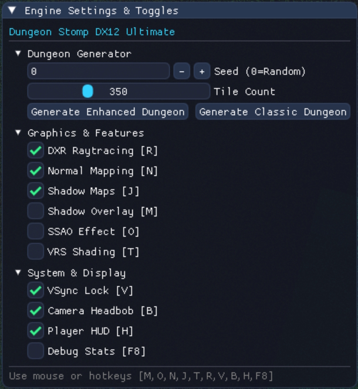
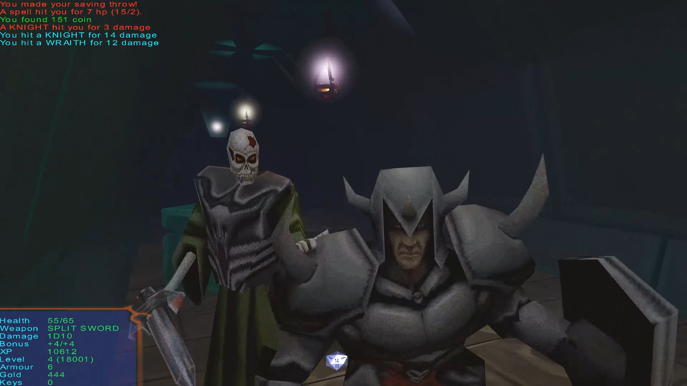

<div align="center">

# Dungeon Stomp DX12 Ultimate DXR

### A Deterministic 3D Procedural Dungeon Crawler Engine for DirectX 12 Ultimate & DXR

[](LICENSE)
[](https://github.com/moonwho101/DungeonStompDX12UltimateDXR)
[](https://devblogs.microsoft.com/directx/announcing-directx-12-ultimate/)
[](https://github.com/moonwho101/DungeonStompDX12UltimateDXR)
[](https://visualstudio.microsoft.com/)



**Dungeon Stomp is a full, playable, deterministic dungeon crawler engine that puts DirectX 12 Ultimate features to work in a live codebase — featuring DXR 1.1 inline ray tracing, PBR materials, Variable Rate Shading, context steering AI, real-time minimap, SSAO, and deterministic simulation.**

[Play Now](#quick-start) · [Dungeon Generator](#dungeon-generator) · [Features](#features) · [Screenshots](#screenshots) · [Controls](#controls) · [Deterministic Simulation & Demos](#deterministic-simulation-and-demos) · [Build](#build-from-source) · [Repository](#repository-structure) · [Credits](#credits)

</div>

---

<a id="quick-start"></a>
## ⚡ Quick Start

Play immediately using the pre-compiled `DungeonStomp.exe` in `bin/`:

```bash
git clone https://github.com/moonwho101/DungeonStompDX12UltimateDXR.git
cd DungeonStompDX12UltimateDXR/bin
DungeonStomp.exe
```

*Requirements: Windows 10/11 with a DirectX 12 GPU. DXR 1.1 hardware (NVIDIA RTX / AMD RX 6000+ / Intel Arc) is required for ray tracing (`R`); otherwise the engine uses the rasterized renderer. Variable Rate Shading (`T`) also requires hardware support.*

---

<a id="dungeon-generator"></a>
## 🎮 Dungeon Generator (Press F7)



Press `F7` to open the settings panel. Enter a seed (`0` = random) and tile count, then click **Generate Classic Dungeon** or **Generate Enhanced Dungeon**. Layouts are saved to `level1.map` and loaded dynamically. Press `F7` again to close.

---

<a id="features"></a>
## ✨ Features

### 🚀 Graphics & Rendering Engine
- **DXR 1.1 Inline Ray Tracing:** `RayQuery` inline shadow rays, 2-sample single-bounce indirect diffuse GI, and ray-traced minimap dispatch.
- **Overhead Minimap:** Real-time orthographic dungeon map in the upper right-hand corner (`L` toggle) displaying player position and heading across raster and DXR modes.
- **PBR Material Pipeline:** Cook-Torrance BRDF metallic workflow with 28 materials (`bin/materials.txt`), MikkTSpace tangents, normal mapping, and ACES tone mapping.
- **DirectX 12 Tech:** Variable Rate Shading (VRS), 2048x2048 shadow maps, SSAO, 3-frame buffering, spatial culling, BMFont GPU text, Dear ImGui overlay, and XAudio2 3D audio.

### ⚔️ Gameplay & Intelligence
- **Context Steering Monster AI:** Dynamic steering evaluated via interest/danger maps, raycasted collision whiskers, ledge probes, and neighbor separation. Features line-of-sight tracking and state transitions (aggressive charge, coward retreat, kiter range-keeping).
- **Campaign & Procedural Levels:** 16 hand-crafted levels plus seed-based procedural dungeon generation.
- **Combat & Arsenal:** Dice-based combat, 25+ animated MD2/3DS monster types, and up to 30 weapon/spell slots (melee, magic scrolls, missiles).
- **Deterministic Simulation:** Fixed-tick updates, seeded PRNG, and exact input demo recording/playback (`F2`/`F3`).

---

<a id="screenshots"></a>
## 🖼️ Screenshots

<div align="center">

| Real-Time DXR Ray-Traced Shadows | Dynamic Combat Encounter |
|:---:|:---:|
|  |  |

<details>
<summary><b>📷 Click to view more screenshots</b></summary>

<br>

| | |
|---|---|
|  |  |
|  |  |

</details>

</div>

---

<a id="controls"></a>
## 🎮 Controls

| Action | Input | Action | Input |
|---|---|---|---|
| **Look / Turn** | `Mouse` | **Cycle Weapons** | `Q` next / `Z` previous, or `Mouse Wheel` |
| **Move Forward / Back** | `W` / `S` (or `Right Click` forward) | **Load / Save** | `F5` / `F6` |
| **Strafe** | `A` / `D` | **Record / Play Demo** | `F2` / `F3` |
| **Attack** | `Left Click` | **Settings Panel (Generator & Toggles)** | `F7` |
| **Jump** | `E` | **On-Screen Debug Stats** | `F8` |
| **Open Doors** | `Space` | **Fullscreen (borderless)** | `Alt`+`Enter` or `F11` |
| **Respawn after death** | `Space` | **Quit** | `Esc` |

*Xbox controller supported (toggle `g_bUseJoystick` in `src/DirectInput.cpp`).*

<details>
<summary><b>🔧 Developer & Feature Hotkeys (Click to expand)</b></summary>

<br>

| Key | Feature Toggle | Key | Feature / Developer |
|:---:|---|:---:|---|
| `L` | Overhead Minimap | `G` | Gravity on/off (fly with Numpad `+` / `-`) |
| `R` | DXR Ray Tracing | `X` | Add 10 XP |
| `T` | Variable Rate Shading | `K` | Unlock all weapons & spells |
| `O` | SSAO | `]` / `[` | Next / previous level |
| `J` | Shadow Maps | `I` | Music on/off |
| `N` | Normal Maps | `P` | Play random song |
| `M` | Shadow Map Overlay | `B` | Camera head bob |
| `V` | VSync | `H` | Player HUD |

</details>

---

<a id="deterministic-simulation-and-demos"></a>
## 🎲 Deterministic Simulation & Demo System

Dungeon Stomp operates on a fixed tick clock and seeded PRNG sequence for 100% reproducible physics, monster AI, combat rolls, and procedural layouts.

- **`F2` Record:** Saves an initial snapshot (`demo.sav`) and records frame-by-frame player inputs to `demo.dem`.
- **`F3` Playback:** Restores the starting snapshot and replays recorded inputs through the simulation loop with exact parity.
- Both files are stored in `bin/`. Live input is disabled during playback.

---

<a id="build-from-source"></a>
## 🛠️ Build from Source

**Prerequisites:** Visual Studio 2022 (v143 C++ toolset) and Windows 10/11 SDK.

```powershell
git clone https://github.com/moonwho101/DungeonStompDX12UltimateDXR.git
cd DungeonStompDX12UltimateDXR
msbuild src\DungeonStomp.sln /p:Configuration=Release /p:Platform=x64
```

| Configuration | Executable Output |
|---|---|
| Release | `bin/DungeonStomp.exe` |
| Debug | `bin/DungeonStompDebug.exe` |

*Runtime dependencies (shaders, assets, level files) are loaded relative to `bin/`.*

---

<a id="repository-structure"></a>
## 📂 Repository Structure

- `bin/` — Pre-built executable, level maps (`.map`/`.cmp`/`.mod`), audio, and runtime assets
- `src/` — Engine & game source code (C++ and Dear ImGui integration)
- `Common/` — D3D12 framework helpers (`d3dApp`, `GameTimer`, `MathHelper`)
- `Shaders/` — HLSL shaders ([Raytracing.hlsl](Shaders/Raytracing.hlsl), PBR, SSAO, shadows)
- `Models/`, `Textures/`, `Sounds/`, `Midi/` — Game media assets
- `tools/` — Asset processing and python dungeon generators (`generate_dungeon.py`, `generate_dungeonNewObjects.py`)

---

<a id="credits"></a>
## 🌐 Credits

*Engine architecture builds upon concepts from "Introduction to 3D Game Programming with DirectX 12 - 2nd Edition" by Frank Luna.*

<details>
<summary><b>🎨 MD2 Model Author Credits</b></summary>

<br>

Special thanks to the authors of the classic MD2 models featured in Dungeon Stomp:

- **ALPHA Werewolf** — Andrew "ALPHAwolf" Gilmour
- **Bauul, Hueteotl, Winter's Faerie** — Evil Bastard
- **Centaur** — Scarecrow
- **Bug (Q2)** — Tatey
- **Corpse** — Neuralstasis
- **Demoness (Succubus)** — Pascal "Firebrandt" Jurock
- **Dragon Knight, Ogro** — Michael "Magarnigal" Mellor
- **Fulimo** — Tim
- **Goblin** — Conrad
- **Grey** — RichB
- **Hellspawn** — Alcor
- **Hydralisk** — warlord
- **Ichabod** — Adam Ward (Gixter)
- **Imp** — Paul Interrante & Brad Grace
- **Insect** — Joe "Ebola" Woodrell
- **Morbo/Brawn** — Rowan Crawford (Sumaleth)
- **Necromancer** — Raven Software
- **Necromicus** — Jade Moffatt Jones
- **Ogre** — Didier "The Doctor" Savanah
- **Orc** — Boogieman
- **Perelith Knight** — James Green
- **Phantom, Wraith** — Burnt Kona
- **Purgatori** — Tom Colby
- **Rider** — Blake
- **Sorcerer** — E. Villiers
- **Tentacle** — Marcus Lutz
- **Troll** — Thargar
- **Werewolf** — Brian Yee

</details>

---

## License

This project is open source. See [LICENSE](LICENSE) for details.

---

<div align="center">

**Happy Dungeon Stomping — Breeyark! ⚔️**

*If you find this project useful for learning DirectX 12 or DXR, please drop a ⭐ star above!*

[](https://github.com/moonwho101/DungeonStompDX12UltimateDXR/stargazers)

</div>
